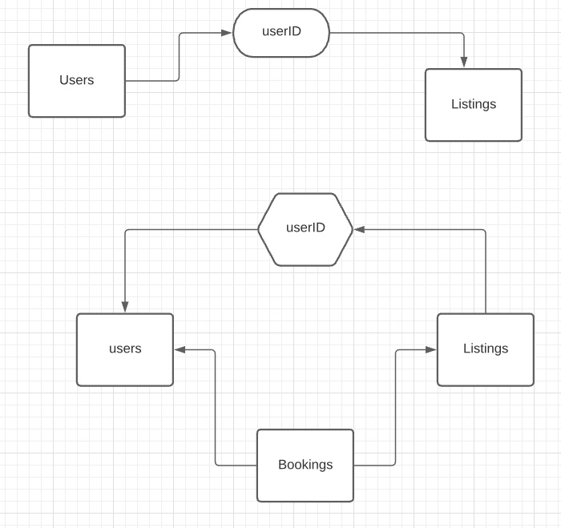

# Database Design Discussion

[README file](../README.md)

## Table Design Discussion


With the need to identify:
  - Listings to a user_id
  AND
  - Bookings to a user_id
  AND
  - a user CAN be an owner and/or a renter

_there is a many to many relationship_

This means the creation of a ```bookings``` table to map this relationship out explicitly.
  - This enables the booking user and owner user to be explicitly mapped, for managing communications, and queries.
