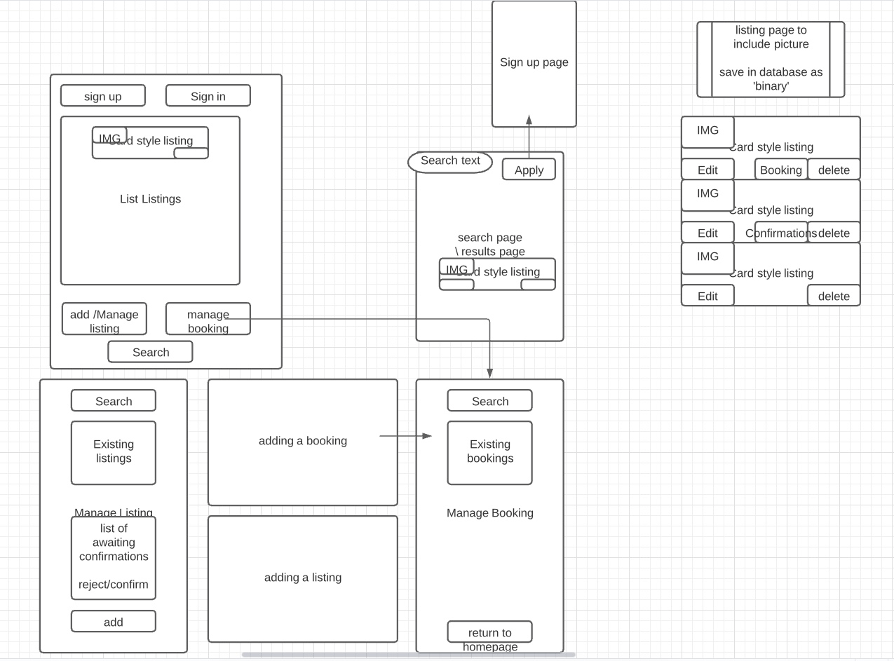

# Initial Interface Design Discussion

[README file](../README.md)

## Initial Design Concept Flow


- discussed the user role flow
  - creating / managing a booking (user role)
  - managing / creating a listing (host role)
  - managing confirmations for a booking (host role)
  - Initial booking through ```homepage``` for a listing
  - ```homepage``` driving initial value for user
  - host functionality only available after sign-in
  - sign-in to be forced on entry to additional functionality

- listings to be in a _card_ format, with functionality dependent on view / listing focus

- search / filtering functionality to be built into the page, not via separate page
